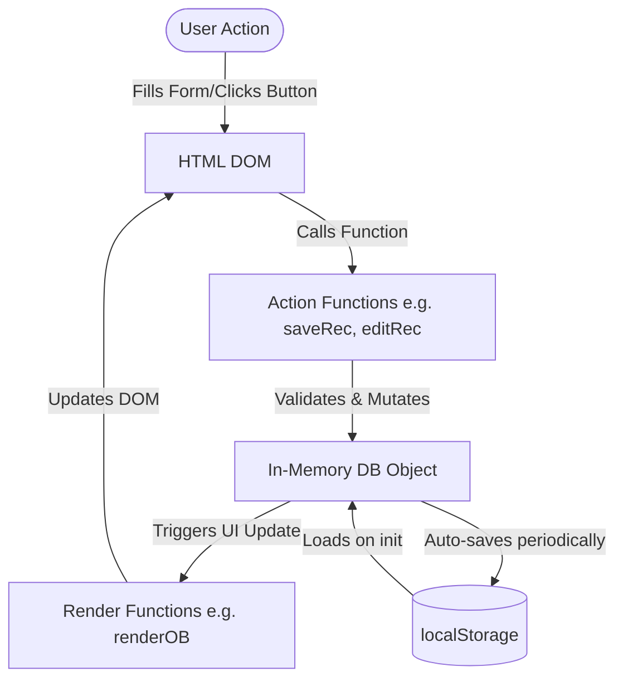

# Data Flow

End-to-end data flow from client request to the "database" and back.

## Flow Diagram

## Description
The application utilizes an imperative data flow pattern:
- User actions trigger JS functions directly.
- The `DB` constant holds the entire application state in memory.
- `saveRec(type)` acts as a centralized mutation dispatcher handling form data parsing, validation, auto-cascading logic (e.g. creating Payment docs when Order Booking is saved), and modifying `DB`.
- Post-mutation, specific render functions are invoked to refresh the UI view.
- A `setInterval(saveDB, 4000)` runs in the background persisting the `DB` state to `localStorage` every 4 seconds.
- On initialization, `loadDB()` pulls state back into memory.
