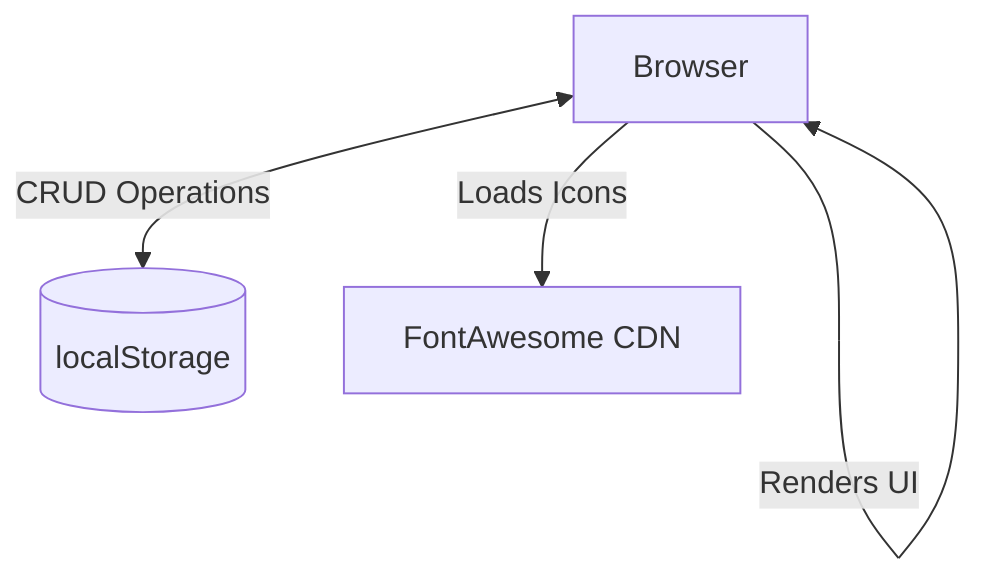

# System Topology

**Context:** Single Page Application (SPA) Monolith
**Environment:** Client-side only
**Persistence:** `localStorage`
**Dependencies:** FontAwesome (Icons)

## Service Boundaries

## Infrastructure details
- No backend server required.
- Everything runs entirely in the browser.
- Data is auto-saved periodically to `localStorage` under `CC_DB_KEY`.
- The `DB` object holds the entire application state in memory.
