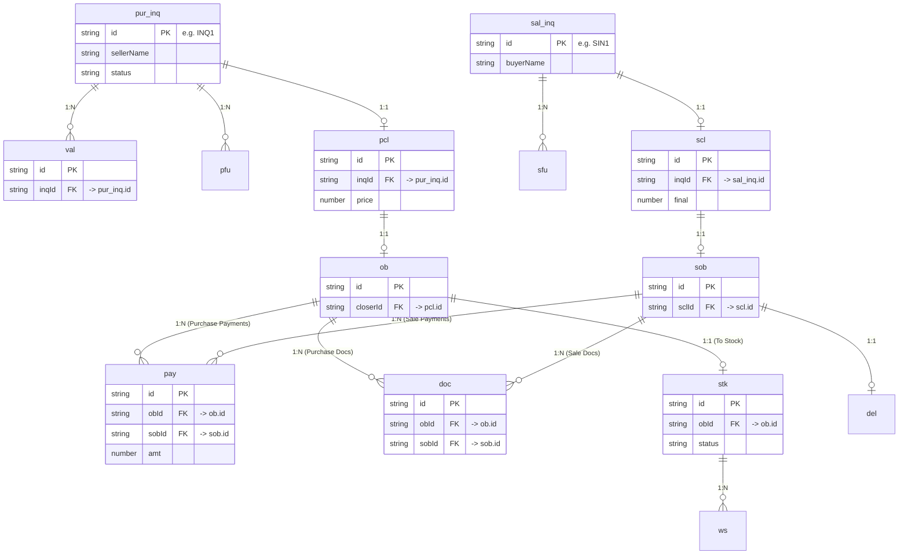

# Schema Overview

## Master ER Diagram

## Entities

| Entity | Table / Collection | ORM Model / Type | File |
|---|---|---|---|
| Purchase Inquiry | `pur_inq` | In-memory Object | [pur_inq.md](./pur_inq.md) |
| Valuation | `val` | In-memory Object | [val.md](./val.md) |
| Purchase Follow-Up | `pfu` | In-memory Object | [pfu.md](./pfu.md) |
| Purchase Closer | `pcl` | In-memory Object | [pcl.md](./pcl.md) |
| Order Booking | `ob` | In-memory Object | [ob.md](./ob.md) |
| Sales Inquiry | `sal_inq` | In-memory Object | [sal_inq.md](./sal_inq.md) |
| Sales Follow-Up | `sfu` | In-memory Object | [sfu.md](./sfu.md) |
| Sales Closer | `scl` | In-memory Object | [scl.md](./scl.md) |
| Sales Order Booking | `sob` | In-memory Object | [sob.md](./sob.md) |
| Car Stock | `stk` | In-memory Object | [stk.md](./stk.md) |
| Workshop | `ws` | In-memory Object | [ws.md](./ws.md) |
| Payment | `pay` | In-memory Object | [pay.md](./pay.md) |
| Delivery | `del` | In-memory Object | [del.md](./del.md) |
| Documents | `doc` | In-memory Object | [doc.md](./doc.md) |
| Customer | `cust` | In-memory Object | [cust.md](./cust.md) |
| Delivery Note | `dn` | In-memory Object | [dn.md](./dn.md) |
| Gate Pass | `gp` | In-memory Object | [gp.md](./gp.md) |
| Sale Process | `sp` | In-memory Object | [sp.md](./sp.md) |
