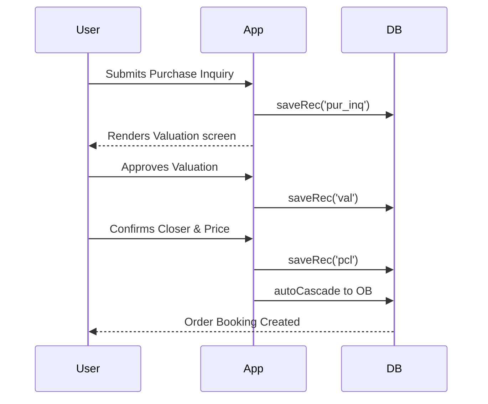

# Feature: Purchase Pipeline

**Source Path:** `index.html` (functions: `renderPurInq`, `renderVal`, `renderPFU`, `renderPCL`, `renderOB`)
**Dependencies:** None external
**Related Data Layer:** [pur_inq](../data_layer/pur_inq.md), [ob](../data_layer/ob.md)

---

## Business Logic Intent
This feature handles the workflow of acquiring used cars from sellers. The process flows from initial inquiry -> vehicle valuation -> follow-up negotiations -> closer (deal confirmed) -> order booking.
It enables sales staff to track where each potential purchase is in the pipeline and ensures proper documentation is recorded when a vehicle is bought.

---

## Functional Breakdown
1. `saveRec('pur_inq')` — Records initial details of a seller's vehicle.
2. `autoCascade('pur_inq_saved')` — After an inquiry is saved, might prompt to start a valuation.
3. `autoCascade('pcl')` — When closer is completed, auto-cascades to create an Order Booking (`ob`).
4. `saveRec('ob')` — Finalizes the purchase transaction details.
5. `autoCascade('ob')` — Post-OB, automatically generates a draft Payment and Document record for the purchase.

---

## Data Interactions
- **Reads:** `DB.pur_inq`, `DB.val`, `DB.pfu`, `DB.pcl`, `DB.ob`
- **Writes:** Mutates the above collections via `saveRec()`

---

## Sequence Diagram

