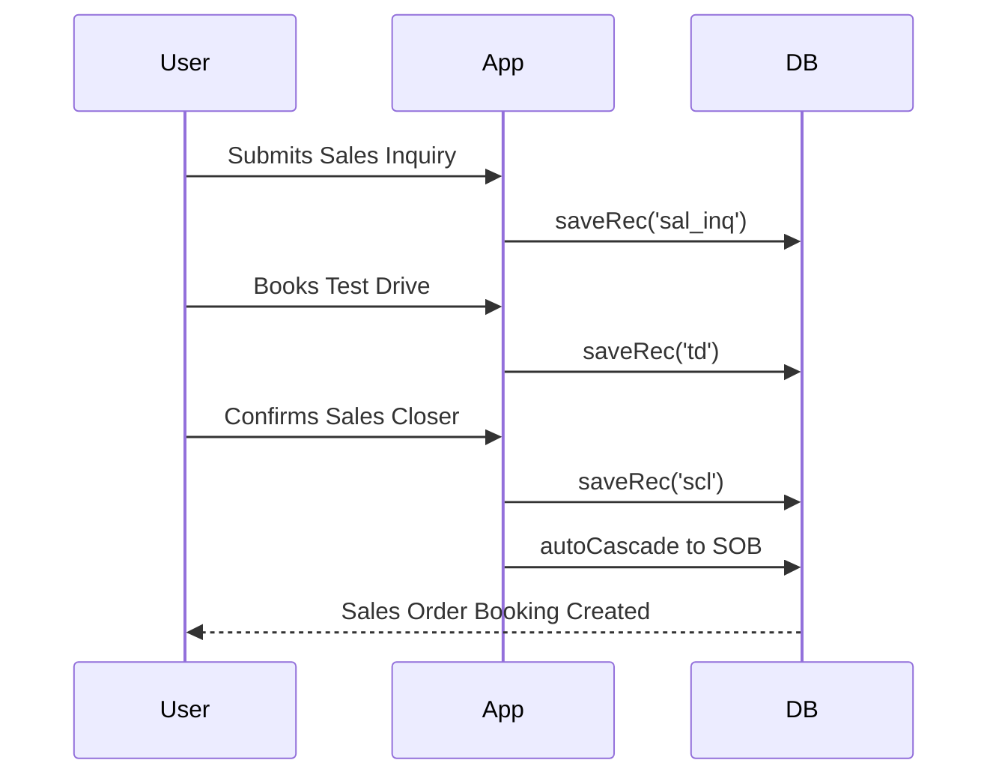

# Feature: Sales Pipeline

**Source Path:** `index.html` (functions: `renderSalInq`, `renderSFU`, `renderSCL`, `renderSOB`)
**Dependencies:** None external
**Related Data Layer:** [sal_inq](../data_layer/sal_inq.md), [sob](../data_layer/sob.md)

---

## Business Logic Intent
This feature handles selling stock vehicles to buyers. It flows from sales inquiry -> follow up -> test drives -> sales closer -> sales order booking -> finance/payment -> delivery.
It tracks the conversion of leads into actual vehicle sales and ensures all financial and delivery steps are fulfilled.

---

## Functional Breakdown
1. `saveRec('sal_inq')` — Captures buyer requirements and budget.
2. `saveRec('scl')` — Records the final agreed price and discount.
3. `saveRec('sob')` — Creates the Sales Order Booking.
4. `autoCascade('sob_saved')` — Prompts to generate Payment, Document, and Delivery records.

---

## Data Interactions
- **Reads:** `DB.sal_inq`, `DB.scl`, `DB.sob`, `DB.stk`
- **Writes:** Mutates the above via `saveRec()`

---

## Sequence Diagram

